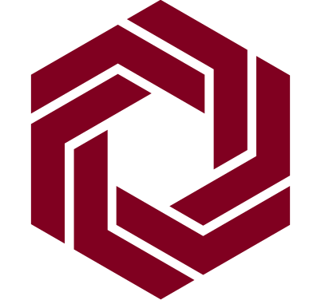

<p align="center">


  <h1 align="center">Nexis</h3>

<!-- TABLE OF CONTENTS -->
<details open="open">
  <summary>Table of Contents</summary>
  <ol>
  <li><a href="#description">Description</a></li>
  <li><a href="#getting-started">Getting started</a></li>
  <li><a href="#code-writing-practice">Code writing practice</a></li>
  <li><a href="#emulators">Emulators</a></li>
  <li><a href="#pushing-code">Pushing code</a></li>
  <li><a href="#git-commands">Git commands</a></li>
  <li><a href="#debugging">Debugging</a></li>
  <li><a href="#testing">Testing</a></li>

</details>

## Description
Nexis is a cha t application built using Flutter and Firebase. Nexis suppoorts not only direct/group messaging, but also voice and video calls using webrtc. It is designed to work on multiple platforms, including android, IOS, web, windows, linux, and macos. The app uses Firebase Firestore as its database and also utilizes other Firebase services. Nexis provides users with a seamless and intuitive chatting experience with a modern and aesthetically pleasing user interface.

## Getting started
To be written.

## Code writing practice
To be written.

## Emulators
To be written.

## Git commands
Git is a version control system that is widely used by developers to manage code changes and collaborate on projects. To contribute to Nexis, it is important to have a basic understanding of Git. Here are some useful Git commands:

Clone a remote repository to your local machine:
```
git clone github-repo-https-link
```

List all existing branches:
```
git branch
```

Create a new branch:
```
git branch your-branch-name
```

Switch to a different branch:
```
git checkout your-branch-name
```

Fetch changes from a remote repository and merge them into your local branch
```
git pull
```

Stage changes for the next commit
```
git add .
```

Save changes with a descriptive message
```
git commit -m "Useful message"
```

Upload changes to a remote repository
```
git push origin your-branch-name
```

It is important to follow good Git practices, such as committing frequently, writing descriptive commit messages, and using feature branches for new work.

## Pushing code
When contributing to Nexis, it's important to follow a structured process for pushing your changes to the project. This helps to ensure that your changes are reviewed and merged in a timely manner, and that the project remains stable and functional.

To push your code changes, we recommend following these steps:
1. Pull changes from the remote branch: Before making any changes to the codebase, use the "git pull" command to ensure that your local copy of the codebase is up to date with the remote branch.

2. Create a new branch for your changes: Once your local copy of the codebase is up to date, create a new branch with a descriptive name that reflects the changes you intend to make. This keeps your changes isolated from the main codebase until they are ready to be merged.

3. Checkout the new branch: Use the "git checkout your-branch-name" command to switch to the new branch.

4. Make and commit your changes: Make small, focused changes to the codebase, and commit them frequently with descriptive commit messages. This makes it easier for reviewers to understand the purpose of each change, and ensures that your changes are easy to review.

5. Push your changes to the remote branch: Use the "git push your-branch-name" command to push your changes to the remote branch on Github.

6. Create a pull request: Create a pull request to merge your changes into the main codebase. Assign a reviewer to your pull request to ensure that your changes are reviewed in a timely manner.

By following this process, you can ensure that your changes are reviewed quickly and effectively, and that the project remains stable and functional.

## Debugging
During the development of Nexis, it's important to utilize the debugging tools that are available to you. Visual Studio Code (VS Code) provides an excellent set of debugging tools that can help you quickly identify and fix issues in your code.

One useful feature of VS Code is the ability to set breakpoints in your code, which allow you to pause the execution of your program at specific points and examine the state of your application. You can also step through your code line by line to see how it executes.

Another useful feature is the debugger console, which allows you to interact with your application while it's running. You can print variables, call functions, and evaluate expressions in the context of your application.

To start debugging in VS Code, simply click the "Run" button in the sidebar, select "Debug", and choose the appropriate configuration. For more information on using the VS Code debugger, see the official documentation.

## Testing
Testing is an essential part of the development process for any software project, and Nexis is no exception. It's important to thoroughly test your code on all platforms to ensure that it works correctly.

Before submitting code changes, make sure to run your tests and ensure that they pass. You should also consider writing automated tests to catch regressions and ensure that your code continues to work as expected over time.

In addition to automated tests, it's important to perform manual testing on all platforms that Nexis supports (mobile, web, and desktop). Make sure to test all features of the application and verify that they work as expected. If you encounter any issues during testing, be sure to report them and work with the team to resolve them before merging your changes.
